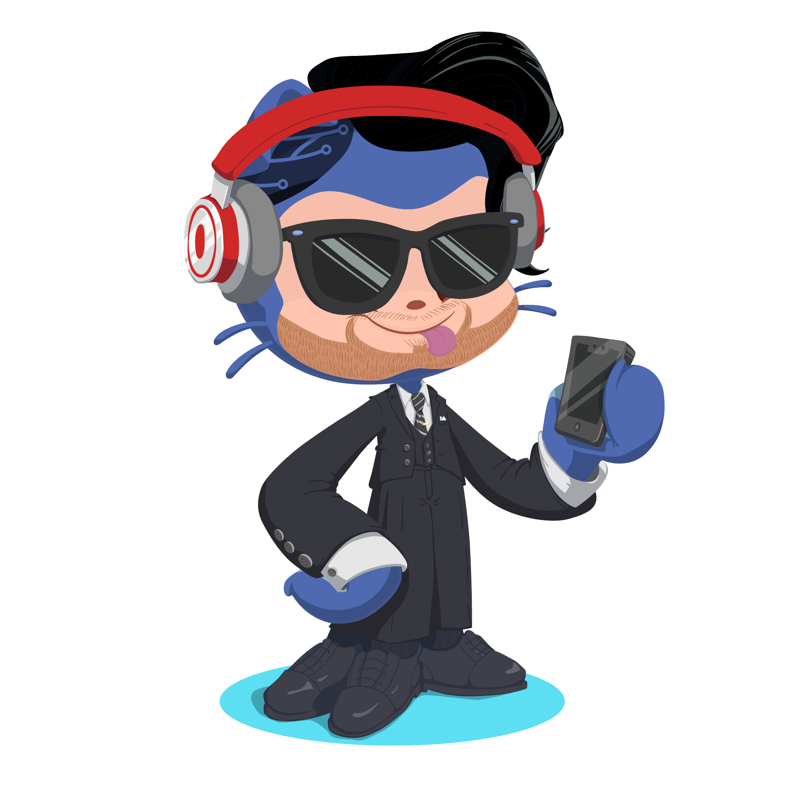

 
 
 
 
 
 
 
 
## Olá, Devs! 👋

### Eu sou o Gabriel Ferneda! 🚀

Sou apaixonado por **programação** e **games**! Tenho 26 anos, sou de São Paulo-SP e estou em uma jornada de transição de carreira. Sou **Jornalista** de formação, mas agora estou me dedicando à **área de desenvolvimento**. Vamos construir juntos o futuro da tecnologia!

## Vamos nos conectar! 🌐

---

## Ferramentas que estou aprendendo 🛠️

Atualmente estou me aprofundando nas seguintes ferramentas e tecnologias:

  
  
  

---

## GIF de Alegria 🎉

Por fim, deixo esse gif para expressar meu entusiasmo! 😄

